# Cockpitのインストール

## Install

```
# dnf install cockpit-dashboard
# systemctl enable cockpit.socket
# systemctl start cockpit.socket
```

Webアクセス  
https://{ipaddress}:9090/  
OSアカウントでログインする  

## コンソール  

### システム  

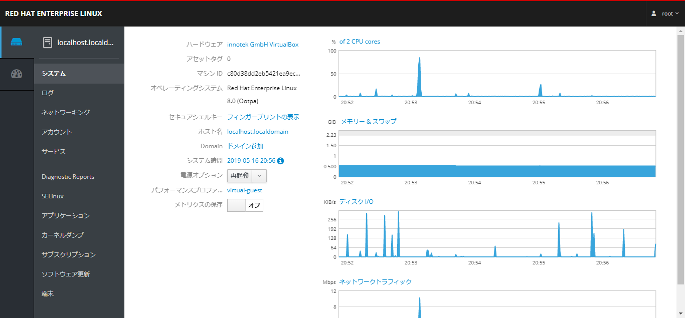  

### ログ  

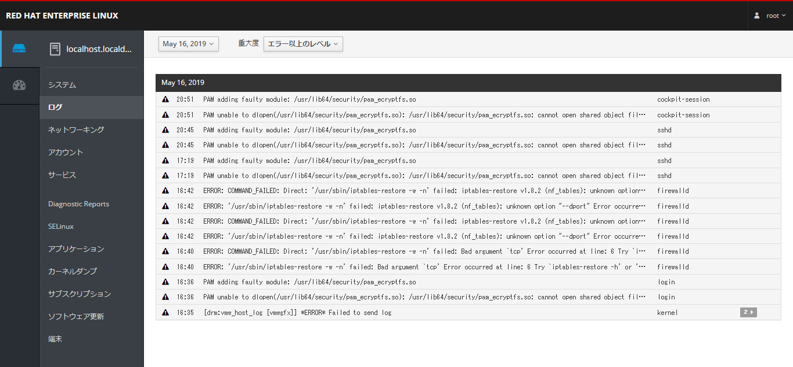  

### ネットワーキング  

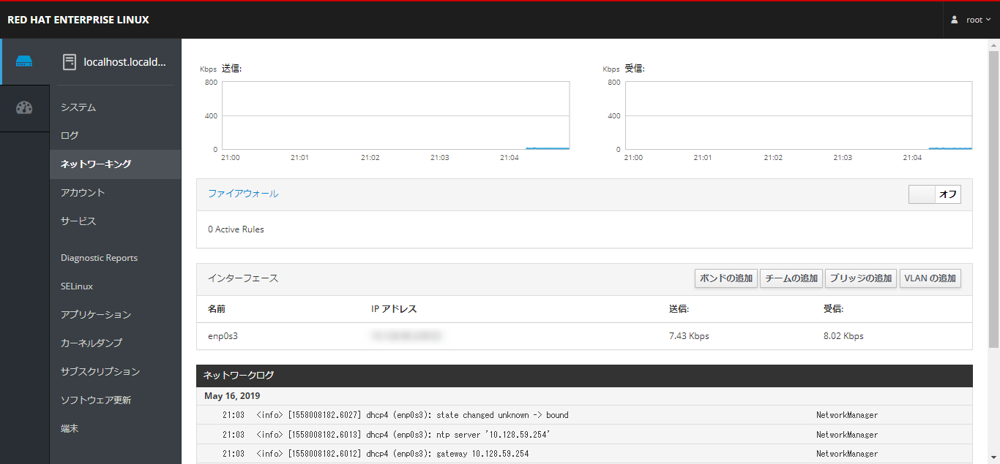  

### アカウント

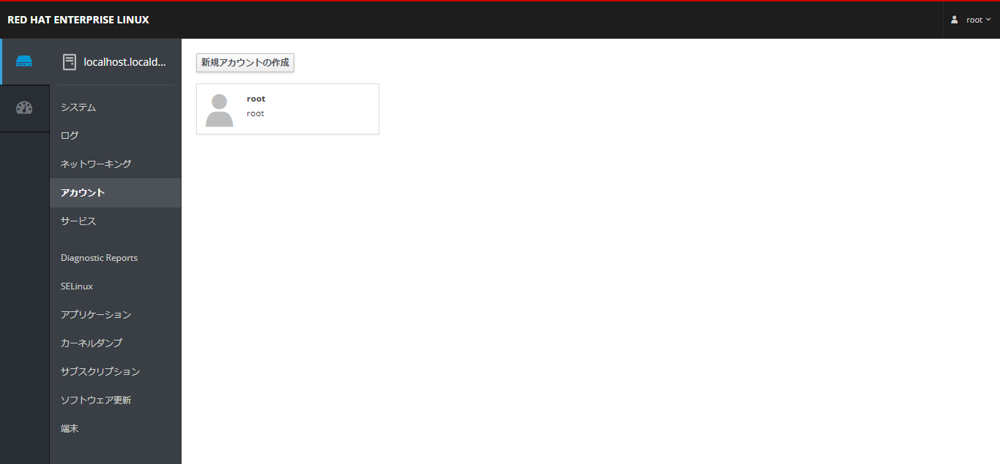  

### サービス

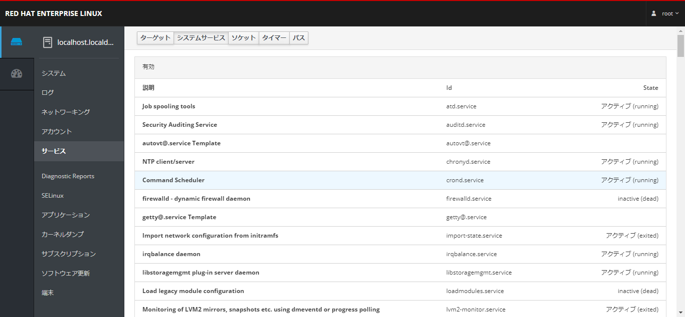  

### Diagnostic Report
SOSレポートの事  
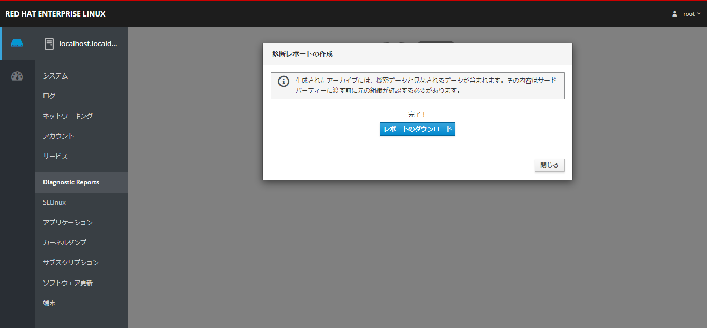  

### SeLinux

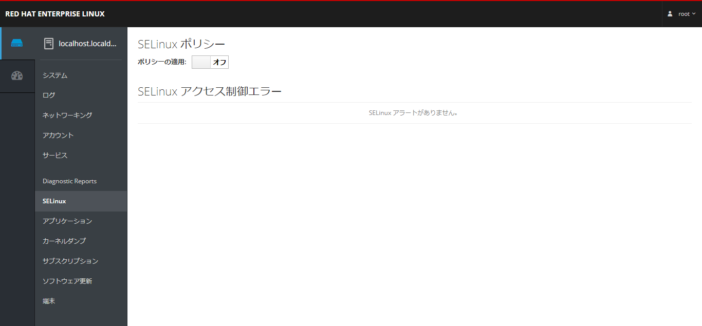  

### アプリケーション
Cockpit用追加アプリケーション管理  
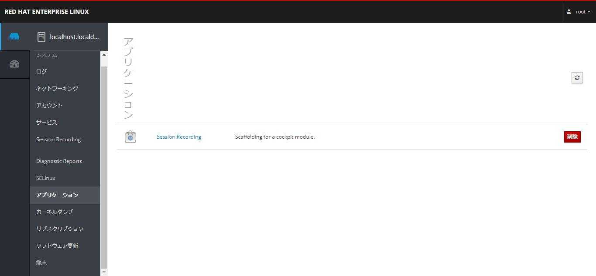  

### カーネルダンプ

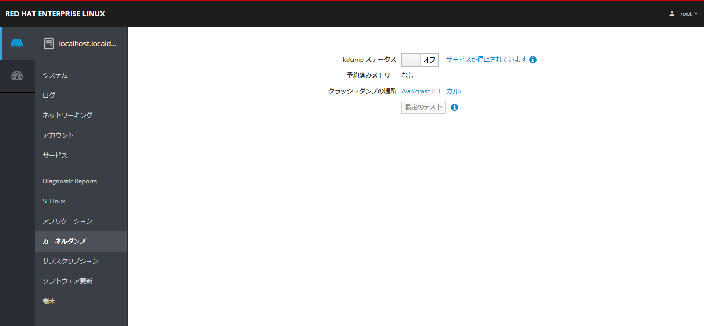  

### サブスクリプション

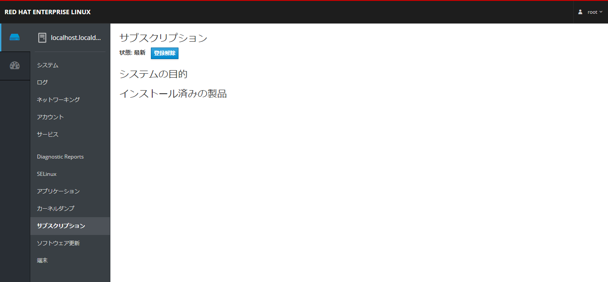  

### ソフトウェア管理

### 端末

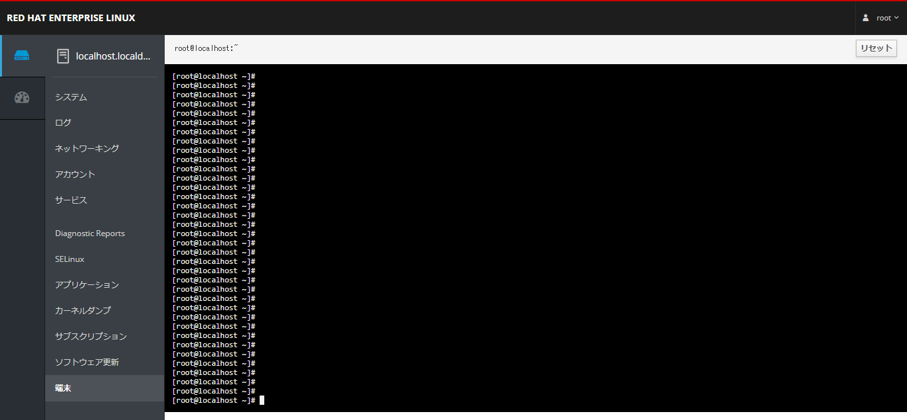  

### ダッシュボード
ダッシュボードは他のサーバを追加できる  
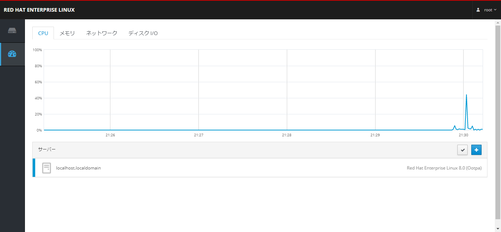  
